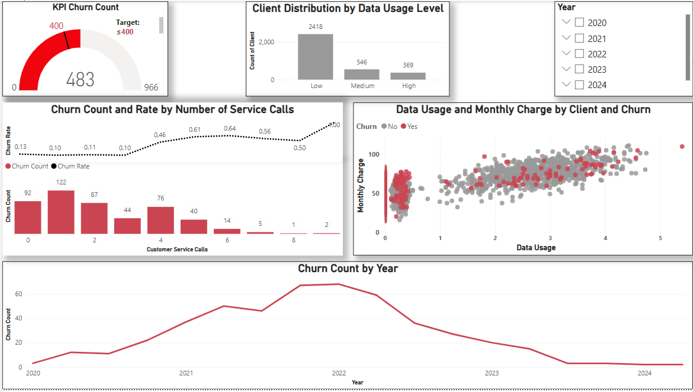

# 📊 Customer Churn Analysis Using Power BI
 
 


---

## 📖 Introduction
Customer churn: the rate at which customers stop doing business with a service provider, is a critical performance indicator in telecom, finance, and SaaS industries.  

This Power BI project analyzes **customer churn from 2020 to 2025** using interactive dashboards, DAX measures, and a custom date table. The goal was to uncover patterns in client attrition and identify actionable factors for improving retention strategies.

---

## 🔗 Live Dashboard
👉 [View the interactive dashboard on Power BI Service](https://app.powerbi.com/groups/me/reports/77e92f67-7f1f-45fb-9204-a7ccc50da0dc/711aadd9a25ecbdddcb7?experience=power-bi)

*(Note: The report is published online for interactive exploration. Please allow time for it to load.)*

---

## 🛠️ Tools & Skills
- **Power BI**: Data modeling, relationships, slicers, interactive visuals  
- **DAX**: Custom measures for churn count, churn rate, rolling averages  
- **Data Modeling**: Dedicated date table with year, month, and quarter for accurate time-series analysis  
- **Visualization**: KPI cards, bar charts, combo charts, scatter plots, line charts  

---

## 📊 Dashboard Highlights

- **KPI Gauge (Churn Count)**  
  Shows **483 churned clients**, highlighting a high attrition rate.  

- **Bar Chart (Client Distribution by Data Usage)**  
  Reveals most churned clients had **low data usage**.  

- **Combo Chart (Service Calls vs. Churn Rate)**  
  Churn rate spikes with **5+ service calls**, suggesting dissatisfaction with support.  

- **Scatter Plot (Data Usage vs. Monthly Charges)**  
  Churned customers cluster in **low usage & low charge** segments.  

- **Line Chart (Churn Over Time)**  
  Churn peaked in **2022** and declined afterward, possibly due to retention programs.  

---

## 📐 DAX Implementation
```DAX
-- Churned Customers
Churn Count =
CALCULATE (
    COUNTROWS('Customer Churn'),
    'Customer Churn'[Churn] = 1
)

-- Churn Rate
Churn Rate =
DIVIDE (
    CALCULATE ( COUNTROWS('Customer Churn'), 'Customer Churn'[Churn] = 1 ),
    COUNTROWS('Customer Churn')
)
```

---

## 📊 Dashboard Preview

Here’s a snapshot of the Power BI dashboard created for customer churn analysis:



---

## 📂 Repository Structure

### Tree View
```
customer-churn-powerbi/
├── powerbi_file/Power BI - Customer Churn github.pbix # Power BI project file
├── powerbi_file/Customer Churn Report github.pdf # Written project report
├── plots/dashboard.png # Dashboard screenshot
├── LICENSE # License (MIT)
├── .gitignore # Ignored files config
└── README.md # Project description (this file)
```

### File Descriptions  
- [**Power BI - Customer Churn**](powerbi_file/Power%20BI%20-%20Customer%20Churn%20github.pbix): Power BI project file with the data model, DAX measures, and interactive dashboard
- [**Customer Churn Report**](powerbi_file/Customer%20Churn%20Report%20github.pdf): Written PDF report with methodology, analysis, and findings    
- [**Dashboard**](plots/dashboard.png): Preview screenshot of the churn dashboard  
- [**.gitignore**](.gitignore): Files/folders excluded from version control  
- [**LICENSE**](LICENSE): Open-source license (MIT)  
- [**README.md**](README.md): Project overview and documentation  

---

## ▶️ How to Use the Power BI File

1. Download the `.pbix` file from the [`powerbi_file/`](powerbi_file) folder.  
2. Open it in **Power BI Desktop**.  
3. Explore the data model, DAX measures, and interactive dashboard.  

---

## 🔑 License

This project is licensed under the MIT License — see the LICENSE file for details.

---

## 📜 References

Microsoft Power BI Documentation. (n.d.). Visualizations in Power BI. Retrieved from https://learn.microsoft.com/en-us/power-bi/

Excelerator BI. (2021). Measures vs Calculated Columns in DAX. Retrieved from https://exceleratorbi.com.au/

McKinney, W. (2022). Effective Data Visualization for Business Intelligence. O’Reilly Media.

---

## 👤 Author  

**Jose De Leon**  
🎓 Master’s in Analytics Candidate, Northeastern University  
📬 [Email me](mailto:j.angel2294@gmail.com)  
🔗 [LinkedIn](https://www.linkedin.com/in/jose-de-leon-analytics/)
